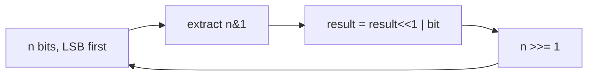
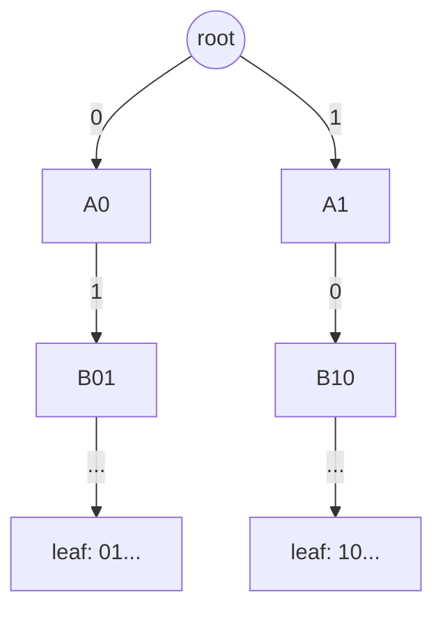
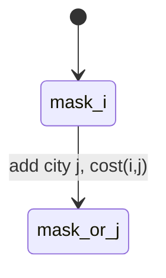

For $n \in \mathbb{Z}_{\ge 0}$, there exists a unique sequence $b_{k-1}, \dots, b_1, b_0 \in \{0,1\}$ such that $ n = \sum_{i=0}^{k-1} b_i \cdot 2^i $

**Powers of two**

| $i$ | 0 | 1 | 2 | 3 | 4 | 5 | 6 | 7 | 8 |
|---|---|---|---|---|---|---|---|---|---|
| $2^i$ | 1 | 2 | 4 | 8 | 16 | 32 | 64 | 128 | 256 |

---

## 2. Two's Complement

> [!definition] Two's Complement
> For a $w$-bit signed integer $x$:
> $$ -x \equiv \ \sim x + 1 \pmod{2^w} $$

> [!theorem] Correctness
> $$ x + \sim x = \underbrace{11\ldots1}_{w}\!\,{}_2 = 2^w - 1 = -1 \pmod{2^w} $$
> $$ \Rightarrow x + (\sim x + 1) = 2^w \equiv 0 \pmod{2^w} \;\Rightarrow\; \sim x + 1 = -x $$

> [!theorem] Isolating the Lowest Set Bit
> $$ x \;\&\; (-x) = x \;\&\; (\sim x + 1) = 2^{\operatorname{ctz}(x)} $$
> *Proof.* Let $x = A\,1\,\underbrace{0\ldots0}_{t}$ (lowest set bit at position $t$). Then $\sim x = \bar A\,0\,\underbrace{1\ldots1}_{t}$, and $\sim x + 1 = \bar A\,1\,\underbrace{0\ldots0}_{t}$. Bit-ANDing with $x$ cancels all bits above position $t$ (since $A \,\&\, \bar A = 0$) and leaves exactly bit $t$ set. $\blacksquare$

```cpp
int lowestSetBit(int x) { return x & (-x); }
```

---

## 3. Shift Operators

> [!definition]
> $$ n \ll k = n \cdot 2^k, \qquad n \gg k = \left\lfloor n / 2^k \right\rfloor \quad (n \ge 0) $$

> [!warning] Constraint
> $1 \ll 31$ overflows a signed 32-bit `int` (UB). Use `1LL << i` or `1U << i` for $i \ge 31$.
> Right shift of a negative signed integer is implementation-defined (typically arithmetic / sign-extending).

```cpp
int64_t shl(int n, int k) { return (int64_t)n << k; }
int     shr(int n, int k) { return n >> k; }
```

---

## 4. Bit-Level Operations ($O(1)$)

*Convention: bits 0-indexed from LSB.*

| Operation | Formula |
|---|---|
| Mask for bit $i$ | $1 \ll i$ |
| Test bit $i$ | $x \,\&\, (1 \ll i) \ne 0$ |
| Set bit $i$ | $x \mathrel{\vert}= (1 \ll i)$ |
| Clear bit $i$ | $x \mathrel{\&}= \sim(1 \ll i)$ |
| Toggle bit $i$ | $x \mathrel{\wedge}= (1 \ll i)$ |
| Lowest set bit | $x \,\&\, (-x)$ |
| Clear lowest set bit | $x \,\&\, (x-1)$ |
| Power-of-two test | $x > 0 \;\wedge\; (x \,\&\, (x-1)) = 0$ |

> [!theorem] Power-of-Two Test
> $x$ has exactly one set bit $\iff x \,\&\, (x-1) = 0$.
> *Proof.* If $x = 2^t$, then $x - 1 = \underbrace{1\ldots1}_{t}$, disjoint from bit $t$, so the AND is $0$. If $x$ has $\ge 2$ set bits, the highest one survives subtraction untouched, so the AND is nonzero. $\blacksquare$

```cpp
int  testBit(int x, int i)   { return (x >> i) & 1; }
int  setBit(int x, int i)    { return x | (1 << i); }
int  clearBit(int x, int i)  { return x & ~(1 << i); }
int  toggleBit(int x, int i) { return x ^ (1 << i); }
bool isPow2(int x)           { return x > 0 && (x & (x - 1)) == 0; }
```

---

## 5. Popcount

> [!definition] Hamming Weight
> $$ \operatorname{popcount}(x) = \sum_i b_i, \quad x = \sum_i b_i 2^i $$

> [!theorem] Kernighan's Algorithm
> $x \,\&\, (x-1)$ clears the lowest set bit. Iterating until $x = 0$ takes exactly $\operatorname{popcount}(x)$ steps.

```cpp
int popcount(unsigned x) {
    int c = 0;
    while (x) { x &= x - 1; c++; }
    return c;
}
// hardware intrinsic (preferred):
// __builtin_popcount(x), __builtin_popcountll(x)
```

**Intrinsics (GCC/Clang)**

| Intrinsic | Definition | Precondition |
|---|---|---|
| `__builtin_popcount(x)` | $\operatorname{popcount}(x)$ | — |
| `__builtin_clz(x)` | leading-zero count | $x \ne 0$ |
| `__builtin_ctz(x)` | trailing-zero count $= \log_2(x \,\&\, {-x})$ | $x \ne 0$ |
| `__builtin_parity(x)` | $\operatorname{popcount}(x) \bmod 2$ | — |

$$ \text{MSB position} = 31 - \operatorname{clz}(x), \qquad \text{bit length} = 32 - \operatorname{clz}(x) $$

---

## 6. XOR Algebra

> [!definition] $(\mathbb{Z}_2^{w}, \oplus)$ is an abelian group
> $$ x \oplus x = 0 \quad \text{(nilpotent)} $$
> $$ x \oplus 0 = x \quad \text{(identity)} $$
> $$ a \oplus b = b \oplus a \quad \text{(commutative)} $$
> $$ (a \oplus b) \oplus c = a \oplus (b \oplus c) \quad \text{(associative)} $$

> [!theorem] Reversibility
> $$ a \oplus b = c \iff a \oplus c = b \iff b \oplus c = a $$
> *Proof.* Add $c$ to both sides of $a \oplus b = c$: $a \oplus b \oplus c = 0 \Rightarrow a \oplus c = b$ (using nilpotency/associativity). $\blacksquare$

```cpp
void xorSwap(int &a, int &b) { a ^= b; b ^= a; a ^= b; }
```

---

## 7. Addition via Bitwise Operators

> [!theorem] Full-Adder Identity
> $$ a + b = (a \oplus b) + 2(a \,\&\, b) $$

*Proof.* Per bit column, $a_i \oplus b_i$ is the sum bit without carry; $a_i \,\&\, b_i = 1$ exactly where a carry is generated. A carry propagates one position left, contributing a factor of $2$. Summed over all columns this reconstructs ordinary addition. $\blacksquare$

**Corollary**
$$ a + b = (a \,\&\, b) + (a \mathrel{\vert} b) $$

---

## 8. Prefix XOR

> [!definition]
> $$ P_0 = 0, \qquad P_i = P_{i-1} \oplus A_i $$

> [!theorem] Range Query
> $$ A_L \oplus A_{L+1} \oplus \cdots \oplus A_R = P_R \oplus P_{L-1} $$
> *Proof.* $P_R \oplus P_{L-1} = (A_1 \oplus \cdots \oplus A_R) \oplus (A_1 \oplus \cdots \oplus A_{L-1})$. Terms $A_1 \ldots A_{L-1}$ cancel by nilpotency, leaving $A_L \oplus \cdots \oplus A_R$. $\blacksquare$

```cpp
vector<int> P(n + 1, 0);
for (int i = 1; i <= n; i++) P[i] = P[i-1] ^ A[i-1];
auto rangeXor = [&](int L, int R) { return P[R+1] ^ P[L]; }; // 0-indexed
```

---

## 9. MSB-Greedy Principle

> [!theorem]
> $$ 2^k > \sum_{i=0}^{k-1} 2^i \quad (\text{since } \sum_{i=0}^{k-1}2^i = 2^k - 1) $$

Consequence: in any bitwise maximization built bit-by-bit from MSB to LSB, securing a $1$ at bit $k$ dominates any combination of lower bits — greedy choice at bit $k$ is never revoked.

---

## 10. Flipping Bits

> [!definition] Bitwise NOT
> $$ \sim x \equiv (2^w - 1) - x $$

```cpp
uint32_t flipBits(uint32_t n) { return ~n; }   // return type must be unsigned
```

> [!warning] Signed reinterpretation
> On a signed 32-bit type, $\sim 1 = -2$ (Two's Complement reading of $11\ldots10_2$); the same bit pattern read as `uint32_t` is $2^{32}-2$.

---

## 11. Reversing Bits

```cpp
int reverseBits(int n) {
    int result = 0;
    for (int i = 0; i < 32; i++) {
        result = (result << 1) | (n & 1);
        n >>= 1;
    }
    return result;
}
```



---

## 12. Maximum XOR over a Contiguous Range $[l, r]$

> [!theorem]
> $$ \max_{l \le a \le b \le r} (a \oplus b) = 2^{\lceil \log_2(l \oplus r + 1) \rceil} - 1 $$

*Proof sketch.* $l \oplus r$ has its highest set bit at the first position where $l, r$ diverge in binary. All values sharing the common prefix but differing below that bit are attainable within $[l, r]$, so every bit at or below the divergence point can be forced to $1$ in some pair's XOR.

```cpp
int maxXorRange(int l, int r) {
    int d = l ^ r;
    if (d == 0) return 0;
    int bits = 32 - __builtin_clz(d);
    return (1 << bits) - 1;
}
```

---

## 13. Maximum XOR Pair — Binary Trie

> [!definition] Bitwise Trie
> A binary tree of depth $B$ (bit-width) where each node has children indexed $\{0,1\}$; each root-to-leaf path encodes one inserted integer, MSB first.



> [!theorem] Greedy Query
> For query $x$, walking the trie choosing the opposite bit of $x$ whenever that child exists yields $\max_y (x \oplus y)$ over inserted $y$ (MSB-greedy, §9).

```cpp
struct XorTrie {
    struct Node { int ch[2] = {-1, -1}; };
    vector<Node> t{Node{}};
    static constexpr int B = 30;

    void insert(int x) {
        int u = 0;
        for (int b = B; b >= 0; b--) {
            int c = (x >> b) & 1;
            if (t[u].ch[c] == -1) { t[u].ch[c] = t.size(); t.push_back({}); }
            u = t[u].ch[c];
        }
    }
    int queryMax(int x) {
        int u = 0, res = 0;
        for (int b = B; b >= 0; b--) {
            int c = (x >> b) & 1, want = c ^ 1;
            if (t[u].ch[want] != -1) { res |= (1 << b); u = t[u].ch[want]; }
            else u = t[u].ch[c];
        }
        return res;
    }
};
```

$$ \text{Time: } O(N \cdot B) \text{ vs. brute force } O(N^2) $$

---

## 14. XOR Linear Basis ($\mathrm{GF}(2)$ Gaussian Elimination)

> [!definition] Linear Basis
> A set $\{v_1, \ldots, v_r\}$ such that every reachable subset-XOR of the input set is a unique $\mathrm{GF}(2)$-linear combination of the $v_i$, with each $v_i$'s highest set bit distinct and not present in any other $v_j$.

```cpp
int basis[30] = {};

bool insertBasis(int x) {
    for (int b = 29; b >= 0; b--) {
        if (!((x >> b) & 1)) continue;
        if (!basis[b]) { basis[b] = x; return true; }
        x ^= basis[b];
    }
    return false; // x in span(basis)
}

int maxXorSubset() {
    int res = 0;
    for (int b = 29; b >= 0; b--)
        res = max(res, res ^ basis[b]);
    return res;
}
```

> [!theorem] Rank–Reachability
> Let $r = |\{b : \text{basis}[b] \ne 0\}|$ (rank). Then:
> $$ \#\{\text{distinct subset-XOR values}\} = 2^r $$
> $$ V \text{ reachable as a subset-XOR} \iff \text{reducing } V \text{ against the basis yields } 0 $$

---

## 15. Set Representation via Bitmasks

> [!definition]
> For universe $U = \{0, \ldots, n-1\}$, a subset $S \subseteq U$ corresponds bijectively to $\mathrm{mask}(S) = \sum_{i \in S} 2^i \in [0, 2^n)$.

| Set operation | Bit operation |
|---|---|
| $A \cap B$ | $A \,\&\, B$ |
| $A \cup B$ | $A \mathrel{\vert} B$ |
| $A \triangle B$ | $A \oplus B$ |
| $A \setminus B$ | $A \,\&\, \sim B$ |
| $A \subseteq B$ | $(A \,\&\, B) = A$ |

```cpp
for (int mask = 0; mask < (1 << n); mask++) {
    for (int i = 0; i < n; i++)
        if (mask & (1 << i)) { /* i ∈ mask */ }
}
```

---

## 16. Submask Enumeration

> [!theorem] $O(3^n)$ Total Complexity
> $$ \sum_{\text{mask}} 2^{\operatorname{popcount}(\text{mask})} = \sum_{k=0}^{n} \binom{n}{k} 2^k = (1+2)^n = 3^n $$
> (binomial theorem; each of the $n$ bits is independently: absent from mask, present in submask, or present in mask but not submask).

```cpp
for (int submask = mask; submask > 0; submask = (submask - 1) & mask) {
    // process submask
}
// submask == 0 handled separately if required
```

> [!theorem] Correctness of `(submask - 1) & mask`
> Subtracting $1$ flips the lowest set bit of `submask` to $0$ and sets all lower bits to $1$; any bit set outside `mask` by this operation is cleared by the subsequent $\&\, \text{mask}$, yielding the strictly-next-lower valid submask.

---

## 17. Sum Over Subsets (SOS) DP

> [!definition]
> Given $f: \{0,1\}^n \to \mathbb{R}$, compute
> $$ g(\text{mask}) = \sum_{s \,\subseteq\, \text{mask}} f(s) \quad \forall\ \text{mask} $$

```cpp
vector<long long> g = f; // f indexed 0..2^n-1
for (int i = 0; i < n; i++)
    for (int mask = 0; mask < (1 << n); mask++)
        if (mask & (1 << i))
            g[mask] += g[mask ^ (1 << i)];
```

$$ \text{Complexity: } O(n \cdot 2^n) \quad (\text{vs. } O(3^n) \text{ direct submask sum}) $$

---

## 18. Gosper's Hack — Fixed-Popcount Enumeration

> [!definition] Next combination
> Given mask with $k$ bits set, produce the next larger mask (in numeric order) with exactly $k$ bits set.

```cpp
unsigned nextCombination(unsigned mask) {
    unsigned c = mask & -mask;
    unsigned r = mask + c;
    return (((mask ^ r) >> 2) / c) | r;
}
// enumerate all n-bit masks with exactly k bits set:
unsigned mask = (1u << k) - 1, limit = 1u << n;
while (mask < limit) {
    // process mask
    mask = nextCombination(mask);
}
```

---

## 19. Bitmask DP — Held–Karp (TSP)

> [!definition] State
> $$ dp[\text{mask}][i] = \min \text{cost to visit exactly the set } \text{mask}, \text{ currently at } i $$

> [!theorem] Recurrence
> $$ dp[\text{mask} \,\vert\, (1\ll j)][j] = \min_{i \in \text{mask}} \big( dp[\text{mask}][i] + \text{cost}(i,j) \big), \quad j \notin \text{mask} $$

```cpp
vector<vector<long long>> dp(1 << n, vector<long long>(n, INF));
dp[1 << start][start] = 0;
for (int mask = 0; mask < (1 << n); mask++)
    for (int i = 0; i < n; i++) {
        if (!(mask & (1 << i)) || dp[mask][i] == INF) continue;
        for (int j = 0; j < n; j++) {
            if (mask & (1 << j)) continue;
            int nx = mask | (1 << j);
            dp[nx][j] = min(dp[nx][j], dp[mask][i] + cost[i][j]);
        }
    }
```

$$ \text{Complexity: } O(2^n \cdot n^2) $$



---

## 20. Broken-Profile DP

> [!definition]
> State bitmask represents the fill-pattern along a DP frontier (e.g. tiling boundary), not a labeled item subset. Transitions use identical operators (§4/§15) applied to a profile rather than a selection.

---

## 21. Adjacent Structures

> [!definition] Gray Code
> $$ G(n) = n \oplus (n \gg 1) $$
> Property: $G(n)$ and $G(n+1)$ differ in exactly one bit.

> [!definition] `std::bitset<N>` word-parallelism
> Packs $N$ bits into $\lceil N/64 \rceil$ machine words; $\&, \vert, \oplus, \ll, \gg, \texttt{.count()}$ operate on 64 bits per instruction $\Rightarrow$ constant-factor speedup of $\sim 64\times$ over `bool[]`.

> [!theorem] Sprague–Grundy (Nim)
> For a sum of independent impartial games with Grundy values $g_1, \ldots, g_m$, the position is a P-position (previous player wins) iff
> $$ g_1 \oplus g_2 \oplus \cdots \oplus g_m = 0 $$

---

## Appendix — Complexity Table

| Technique | Complexity |
|---|---|
| Subset enumeration | $O(2^n)$ |
| Submask enumeration (all masks) | $O(3^n)$ |
| SOS DP | $O(n \cdot 2^n)$ |
| Trie max-XOR pair | $O(N \cdot B)$ |
| XOR basis build | $O(N \cdot B)$ |
| Held–Karp TSP | $O(2^n \cdot n^2)$ |
| Popcount (Kernighan) | $O(\operatorname{popcount}(x))$ |

## Appendix — Formula Index

$$
\begin{aligned}
&\text{test}(x,i) = x \,\&\, (1\ll i) &&\text{set}(x,i) = x \mathrel{\vert} (1 \ll i)\\
&\text{clear}(x,i) = x \,\&\, \sim(1\ll i) &&\text{toggle}(x,i) = x \oplus (1\ll i)\\
&\text{lowbit}(x) = x \,\&\, (-x) &&\text{clearlow}(x) = x \,\&\, (x-1)\\
&a+b = (a\oplus b) + 2(a\,\&\,b) &&a+b = (a\,\&\,b)+(a\mathrel{\vert}b)\\
&P_R \oplus P_{L-1} = \textstyle\bigoplus_{i=L}^{R} A_i &&G(n) = n \oplus (n\gg1)
\end{aligned}
$$