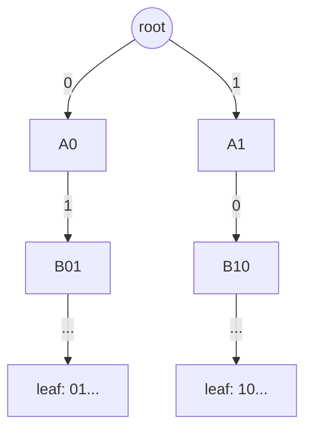
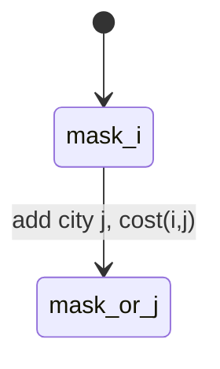

## 12. Maximum XOR over a Contiguous Range $[l, r]$

> [!theorem]
> $$ \max_{l \le a \le b \le r} (a \oplus b) = 2^{\lceil \log_2(l \oplus r + 1) \rceil} - 1 $$

*Proof sketch.* $l \oplus r$ has its highest set bit at the first position where $l, r$ diverge in binary. All values sharing the common prefix but differing below that bit are attainable within $[l, r]$, so every bit at or below the divergence point can be forced to $1$ in some pair's XOR.

```cpp
int maxXorRange(int l, int r) {
    int d = l ^ r;
    if (d == 0) return 0;
    int bits = 32 - __builtin_clz(d);
    return (1 << bits) - 1;
}
```

---

## 13. Maximum XOR Pair — Binary Trie

> [!definition] Bitwise Trie
> A binary tree of depth $B$ (bit-width) where each node has children indexed $\{0,1\}$; each root-to-leaf path encodes one inserted integer, MSB first.



> [!theorem] Greedy Query
> For query $x$, walking the trie choosing the opposite bit of $x$ whenever that child exists yields $\max_y (x \oplus y)$ over inserted $y$ (MSB-greedy, §9).

```cpp
struct XorTrie {
    struct Node { int ch[2] = {-1, -1}; };
    vector<Node> t{Node{}};
    static constexpr int B = 30;

    void insert(int x) {
        int u = 0;
        for (int b = B; b >= 0; b--) {
            int c = (x >> b) & 1;
            if (t[u].ch[c] == -1) { t[u].ch[c] = t.size(); t.push_back({}); }
            u = t[u].ch[c];
        }
    }
    int queryMax(int x) {
        int u = 0, res = 0;
        for (int b = B; b >= 0; b--) {
            int c = (x >> b) & 1, want = c ^ 1;
            if (t[u].ch[want] != -1) { res |= (1 << b); u = t[u].ch[want]; }
            else u = t[u].ch[c];
        }
        return res;
    }
};
```

$$ \text{Time: } O(N \cdot B) \text{ vs. brute force } O(N^2) $$

---

## 14. XOR Linear Basis ($\mathrm{GF}(2)$ Gaussian Elimination)

> [!definition] Linear Basis
> A set $\{v_1, \ldots, v_r\}$ such that every reachable subset-XOR of the input set is a unique $\mathrm{GF}(2)$-linear combination of the $v_i$, with each $v_i$'s highest set bit distinct and not present in any other $v_j$.

```cpp
int basis[30] = {};

bool insertBasis(int x) {
    for (int b = 29; b >= 0; b--) {
        if (!((x >> b) & 1)) continue;
        if (!basis[b]) { basis[b] = x; return true; }
        x ^= basis[b];
    }
    return false; // x in span(basis)
}

int maxXorSubset() {
    int res = 0;
    for (int b = 29; b >= 0; b--)
        res = max(res, res ^ basis[b]);
    return res;
}
```

> [!theorem] Rank–Reachability
> Let $r = |\{b : \text{basis}[b] \ne 0\}|$ (rank). Then:
> $$ \#\{\text{distinct subset-XOR values}\} = 2^r $$
> $$ V \text{ reachable as a subset-XOR} \iff \text{reducing } V \text{ against the basis yields } 0 $$

---

## 15. Set Representation via Bitmasks

> [!definition]
> For universe $U = \{0, \ldots, n-1\}$, a subset $S \subseteq U$ corresponds bijectively to $\mathrm{mask}(S) = \sum_{i \in S} 2^i \in [0, 2^n)$.

| Set operation | Bit operation |
|---|---|
| $A \cap B$ | $A \,\&\, B$ |
| $A \cup B$ | $A \mathrel{\vert} B$ |
| $A \triangle B$ | $A \oplus B$ |
| $A \setminus B$ | $A \,\&\, \sim B$ |
| $A \subseteq B$ | $(A \,\&\, B) = A$ |

```cpp
for (int mask = 0; mask < (1 << n); mask++) {
    for (int i = 0; i < n; i++)
        if (mask & (1 << i)) { /* i ∈ mask */ }
}
```

---

## 16. Submask Enumeration

> [!theorem] $O(3^n)$ Total Complexity
> $$ \sum_{\text{mask}} 2^{\operatorname{popcount}(\text{mask})} = \sum_{k=0}^{n} \binom{n}{k} 2^k = (1+2)^n = 3^n $$
> (binomial theorem; each of the $n$ bits is independently: absent from mask, present in submask, or present in mask but not submask).

```cpp
for (int submask = mask; submask > 0; submask = (submask - 1) & mask) {
    // process submask
}
// submask == 0 handled separately if required
```

> [!theorem] Correctness of `(submask - 1) & mask`
> Subtracting $1$ flips the lowest set bit of `submask` to $0$ and sets all lower bits to $1$; any bit set outside `mask` by this operation is cleared by the subsequent $\&\, \text{mask}$, yielding the strictly-next-lower valid submask.

---

## 17. Sum Over Subsets (SOS) DP

> [!definition]
> Given $f: \{0,1\}^n \to \mathbb{R}$, compute
> $$ g(\text{mask}) = \sum_{s \,\subseteq\, \text{mask}} f(s) \quad \forall\ \text{mask} $$

```cpp
vector<long long> g = f; // f indexed 0..2^n-1
for (int i = 0; i < n; i++)
    for (int mask = 0; mask < (1 << n); mask++)
        if (mask & (1 << i))
            g[mask] += g[mask ^ (1 << i)];
```

$$ \text{Complexity: } O(n \cdot 2^n) \quad (\text{vs. } O(3^n) \text{ direct submask sum}) $$

---

## 18. Gosper's Hack — Fixed-Popcount Enumeration

> [!definition] Next combination
> Given mask with $k$ bits set, produce the next larger mask (in numeric order) with exactly $k$ bits set.

```cpp
unsigned nextCombination(unsigned mask) {
    unsigned c = mask & -mask;
    unsigned r = mask + c;
    return (((mask ^ r) >> 2) / c) | r;
}
// enumerate all n-bit masks with exactly k bits set:
unsigned mask = (1u << k) - 1, limit = 1u << n;
while (mask < limit) {
    // process mask
    mask = nextCombination(mask);
}
```

---

## 19. Bitmask DP — Held–Karp (TSP)

> [!definition] State
> $$ dp[\text{mask}][i] = \min \text{cost to visit exactly the set } \text{mask}, \text{ currently at } i $$

> [!theorem] Recurrence
> $$ dp[\text{mask} \,\vert\, (1\ll j)][j] = \min_{i \in \text{mask}} \big( dp[\text{mask}][i] + \text{cost}(i,j) \big), \quad j \notin \text{mask} $$

```cpp
vector<vector<long long>> dp(1 << n, vector<long long>(n, INF));
dp[1 << start][start] = 0;
for (int mask = 0; mask < (1 << n); mask++)
    for (int i = 0; i < n; i++) {
        if (!(mask & (1 << i)) || dp[mask][i] == INF) continue;
        for (int j = 0; j < n; j++) {
            if (mask & (1 << j)) continue;
            int nx = mask | (1 << j);
            dp[nx][j] = min(dp[nx][j], dp[mask][i] + cost[i][j]);
        }
    }
```

$$ \text{Complexity: } O(2^n \cdot n^2) $$



---

## 20. Broken-Profile DP

> [!definition]
> State bitmask represents the fill-pattern along a DP frontier (e.g. tiling boundary), not a labeled item subset. Transitions use identical operators (§4/§15) applied to a profile rather than a selection.
